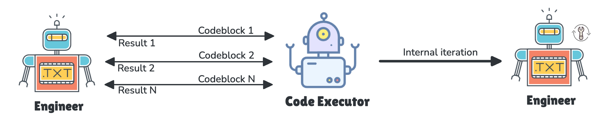
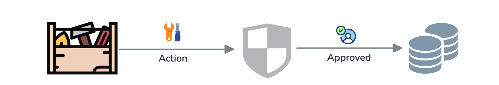

<p align="center">
  
</p>

---

# ZenAgent

**ZenAgent** empowers developers to create AI assistants, providing the capability to build sophisticated multi-agent systems. Its features include:

- **Boost Autonomy**

  
  ZenAgent differ from those in systems like [AutoGen](https://microsoft.github.io/autogen/0.2/). With built-in tools, they operate independently, eliminating the need to rely on other agents for information. This allows them to iterate on a task before delivering results or involving another agent, reducing unnecessary interactions and agents.

- **Tool Integration**

  Unlike [LangChain](https://python.langchain.com/docs/how_to/custom_tools/) or [AutoGen](https://microsoft.github.io/autogen/0.2/docs/tutorial/tool-use/), which require following serval rules to register functions or tools, ZenAgent allows you to simply write a function and add a comment. The agent will automatically use the tool to solve tasks. As shown in the example below, check out sample/agent_tool.py for a quick start.

  ```python
  Agent(
    model_client,
    "Assistant AI", "You are an assistant to solve tasks",
    tools=[wikipedia],
  ).run()
  ```

- **Governed Actions**

  
  Actions performed by the ZenAgent are regulated by developers with three permission levels:  
  - **`auto`**: Requests permission only for actions that modify the system or environment[PromptAgent]
  - **`always`**: Requests permission for every action.  
  - **`none`**: Never requests permission.  

- **Multi-Agent System**

  Transitioning the zen-agent into a multi-agent system a straightforward process. The handoff workflow for orchestrating agents draws inspiration from the post [Routines and Handoffs](https://cookbook.openai.com/examples/orchestrating_agents#executing-routines), which details the functionality of the [Swarm](https://github.com/openai/swarm) project. We strive to achieve a harmonious balance, enabling you to create a single agent for specific tasks while effortlessly evolving towards a sophisticated multi-agent framework.

  This demo provides advice on what to wear when traveling to a city: <a href="https://asciinema.org/a/686709">
    
  </a>

- **Memory** [PROCESSING]  

  Memory capabilities enhance accuracy and optimize thought processes by transitioning from stateless to stateful operations. Unlike Retrieval-Augmented Generation (RAG), which builds knowledge from external sources, our approach is based on the agent's own experiences.

  Zen-Agent provides an interface called `ChatMemory` that allows you to customize memory for your assistant. We offer two default memory implementations:

  1. `ChatBufferMemory` A short-term memory solution designed to retrieve the most recent message along with the current session context.

  2. `ChatVectorMemory` A long-term memory implementation based on LlamaIndex [vector memory](https://docs.llamaindex.ai/en/stable/examples/agent/memory/vector_memory/).

  > [MemGPT: Towards LLMs as Operating Systems](https://arxiv.org/pdf/2310.08560)
  > [CLIN: A CONTINUALLY LEARNING LANGUAGE AGENT FOR RAPID TASK ADAPTATION AND GENERALIZATION](https://arxiv.org/pdf/2310.10134)

  3. `ChatPgMemory` ...

- **RAG Support**

We also provide a retrieval agent capable of integrating local resources or knowledge into the multi-agent system. The default implementation is based on LlamaIndex's [ChatEngine](https://docs.llamaindex.ai/en/stable/examples/chat_engine/chat_engine_best/).